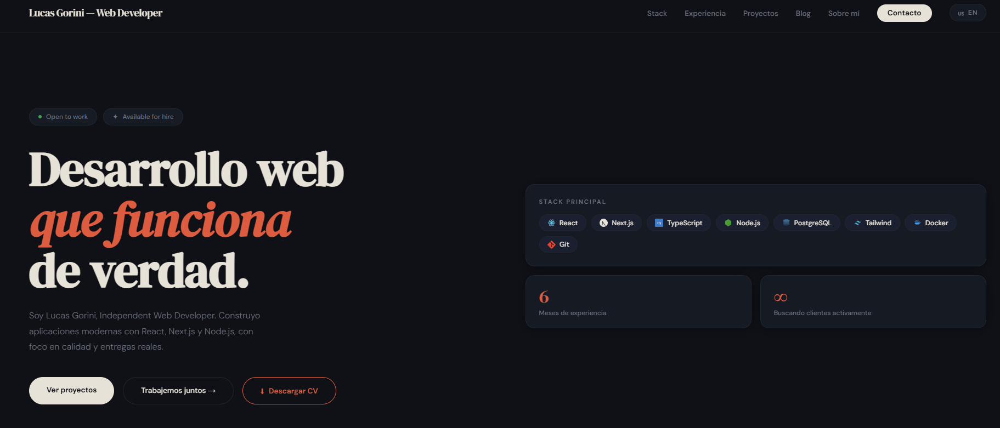

# 🚀 Lucas Gorini — Developer Portfolio

## 🧠 About the Project

This is my personal portfolio website, built to showcase my work, skills, and approach as a web developer.

I focus on creating **real, functional, and scalable web applications** — not just visually appealing ones.

---

## ⚡ Key Features

- Responsive and modern UI 📱  
- High performance and optimized loading 🚀  
- Clean and scalable architecture 🧩  
- Reusable components  
- Production-ready deployment  

---

## 🛠️ Tech Stack

- ⚛️ React  
- ▲ Next.js  
- 🟦 TypeScript  
- 🌐 Node.js  
- 🐘 PostgreSQL  
- 🎨 Tailwind CSS  
- 🐳 Docker  
- 🔧 Git  

---

## 🌐 Live Demo

👉 https://lucasgoriniportfolio.vercel.app/

---

## 🎯 Philosophy

> “Build things that actually work in real-world scenarios.”

This portfolio represents how I think as a developer:
- Focus on results
- Optimize performance
- Keep things simple and scalable

---

## 📸 Preview

---

## 🤝 Let's Connect

- 💼 Portfolio: https://lucasgoriniportfolio.vercel.app/
- 🧑‍💻 GitHub: https://github.com/Schenvz

---

## 📌 Status

🚀 Currently open to new opportunities and collaborations.
